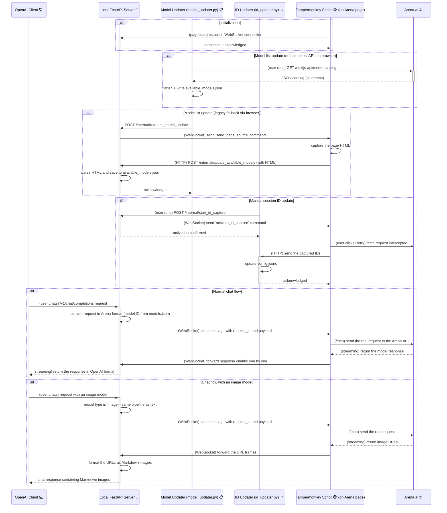

# 🚀 LMArena Bridge - AI Model Arena API Proxy 🌉

Welcome to the new generation of LMArena Bridge! 🎉 This is a high-performance toolset built on **FastAPI** and **WebSocket** that lets you use the large language models available on [LMArena.ai](https://lmarena.ai/) — now rebranded to **[Arena.ai](https://arena.ai/)** — through any OpenAI-API-compatible client or application.

This refactored version aims to provide a more stable experience that is easier to maintain and extend.

> **⚠️ Compatibility note (October 2026):** lmarena.ai now redirects to **arena.ai**. This build matches both domains and tries the site's current `/nextjs-api/stream/...` endpoint before falling back to the legacy `/api/stream/...` one. Arena.ai has also started requiring reCAPTCHA tokens for some retry calls — see **[PROJECT_SUMMARY.md](PROJECT_SUMMARY.md)** for a full, verified status report of what works and what does not.

## ✨ Key Features

*   **🚀 High-performance backend**: Built on **FastAPI** and **Uvicorn**, providing an asynchronous, high-performance API service.
*   **🔌 Stable WebSocket communication**: Uses WebSocket instead of Server-Sent Events (SSE) for more reliable, low-latency two-way communication.
*   **🤖 OpenAI-compatible interface**: Compatible with the OpenAI `v1/chat/completions` and `v1/models` endpoints (image generation is integrated into chat completions).
*   **📋 One-command model list updates**: `model_updater.py` fetches Arena.ai's public model-catalog API **directly** (no browser or server needed) and saves every model — with its arena categories — to `available_models.json`. A legacy browser-based extraction path remains as a fallback (`--via-browser`).
*   **🔥 Hot-reloading configuration**: `config.jsonc`, `models.json` and `model_endpoint_map.json` are picked up automatically when they change — **no server restart needed**.
*   **📎 Universal file upload**: Supports uploading any file type (images, audio, PDF, code, etc.) via Base64, including multiple files at once.
*   **🎨 Native streaming text-to-image**: Text-to-image is fully unified with text generation. Request an image model through `/v1/chat/completions` and receive Markdown-formatted images as a stream, exactly like text.
*   **🗣️ Full conversation history support**: Automatically injects the conversation history for contextual, continuous conversations.
*   **🌊 Real-time streaming responses**: Receive text responses from models in real time, just like the native OpenAI API.
*   **🔄 Automatic program updates**: Checks the GitHub repository at startup and can automatically download and apply updates.
*   **🆔 One-click session ID updates**: `id_updater.py` needs just one browser click (Retry) to capture and write the session IDs into `config.jsonc`.
*   **⚙️ Browser automation — two flavors**: use either the bundled **Chrome extension** (`chrome-extension/`, Manifest V3, load-unpacked — no extra dependencies, toolbar badge status, cleaner `webRequest`-based ID capture) **or** the classic **Tampermonkey script** (`LMArenaApiBridge.js`, works in Chrome/Firefox/Edge). Both talk the same protocol to the backend.
*   **🍻 Tavern Mode**: Designed for applications like SillyTavern; intelligently merges `system` prompts for compatibility.
*   **🤫 Bypass Mode**: Attempts to bypass sensitive-word moderation by injecting an extra empty user message.
*   **🔐 API key protection**: Optionally require an API key for all chat requests.
*   **🎯 Advanced model-session mapping**: Independent session ID pools per model, each bound to a working mode (`battle` or `direct_chat`).

## 🛠️ Quick Start (Step by Step)

### Prerequisites

| Requirement | Notes |
|---|---|
| **Python 3.10+** | The code uses modern `X \| None` type syntax |
| **A desktop browser** | Chrome/Edge/Brave (extension or userscript) or Firefox (userscript) |
| **The browser bridge** | Either the bundled **Chrome extension** (recommended, no extra installs) **or** [Tampermonkey](https://www.tampermonkey.net/) — pick **one** |
| **An Arena.ai account** | You must be logged in on the site in that browser |

### Step 1 — Get the code and install dependencies

```bash
git clone https://github.com/freeforall1932-design/LMArena-fork.git
cd LMArena-fork
python -m venv .venv
source .venv/bin/activate        # Windows: .venv\Scripts\activate
pip install -r requirements.txt
```

### Step 2 — Install the browser bridge (pick ONE option)

**Option A — Chrome extension (recommended for Chrome/Edge/Brave):**

1. Open `chrome://extensions`.
2. Enable **Developer mode** (top-right toggle).
3. Click **Load unpacked** and select the **`chrome-extension/`** folder of this repo.
4. Pin the 🌉 icon — its badge shows the live status: `–` idle, **`ON`** connected, **`CAP`** capture armed, **`ERR`** connection error. Ports are configurable from the popup.
5. Details: [`chrome-extension/README.md`](chrome-extension/README.md).

**Option B — Tampermonkey userscript (any browser incl. Firefox):**

1. Install the [Tampermonkey](https://www.tampermonkey.net/) extension.
2. Open the Tampermonkey dashboard → **"Create a new script"**.
3. Delete the template, paste the **entire** contents of [`TampermonkeyScript/LMArenaApiBridge.js`](TampermonkeyScript/LMArenaApiBridge.js), and save (`Ctrl+S`).

> ⚠️ Never run both at once — every bridge instance opens its own WebSocket and the server keeps only the last connection, so they would fight each other.

### Step 3 — Start the local server

```bash
python api_server.py
```

**✔️ Checkpoint** — you should see logs ending with:

```
Server startup complete. Waiting for the Tampermonkey script to connect...
INFO:     Uvicorn running on http://127.0.0.1:5102 (Press CTRL+C to quit)
```

Leave this terminal open. The server binds to `127.0.0.1:5102` by default; change `server_host` / `server_port` in `config.jsonc` if you need LAN/Docker access (and update the ports in the userscript accordingly).

### Step 4 — Open Arena and connect the bridge

1. In the **same browser** that has the extension (or Tampermonkey), go to <https://arena.ai/> (or <https://lmarena.ai/> — it redirects).
2. Log in if you aren't already.
3. Any page on the domain works — chat, leaderboard, etc.

**✔️ Checkpoint** — the page **title starts with ✅**, the browser console (F12) shows:

```
[API Bridge] ✅ WebSocket connection to the local server established.
```

and, if you installed the extension, the toolbar badge reads **ON** (green).

### Step 5 — Capture a session ID (one-time setup)

The bridge needs one valid `session_id` + `message_id` pair from a real conversation.

1. Keep the server from Step 3 running.
2. In a **new terminal**:
   ```bash
   python id_updater.py
   ```
3. Choose a mode: `a` = **DirectChat** (recommended for first setup) or `b` = **Battle**.
4. In the browser, open a conversation where **the last message is an answer from your target model** (in Battle mode, don't peek at model names; the required "search" models must use target **A**).
5. Click the **Retry** button on that answer's card.

**✔️ Checkpoint** — the page title briefly shows 🎯 (extension badge: **CAP**), then the terminal prints:

```
🎉 Successfully captured the IDs from the browser!
✅ IDs updated successfully.
```

The script writes the IDs into `config.jsonc` and exits. Done — this rarely needs repeating (only when the conversation dies or you switch model families).

### Step 6 — (Optional, recommended) Refresh the model list

```bash
python model_updater.py
```

This fetches Arena.ai's **public model-catalog API directly** — no browser tab and no running server required.

**✔️ Checkpoint** — the output ends with:

```
✅ 'available_models.json' updated with 251 unique models.
```

Open `available_models.json`, pick the models you want (each entry shows which `arenas` it belongs to — text, code, text-to-image, search, text-to-video, document), and copy their `"publicName": "id"` pairs into `models.json` (append `":image"` to the id for text-to-image models). Thanks to hot reloading, the server picks up your edit **without a restart**.

> If the direct fetch is ever blocked, the script automatically falls back to the legacy browser-based flow (requires the server from Step 3 and an open Arena tab); force it with `--via-browser`.

### Step 7 — Point your OpenAI client at the bridge

| Setting | Value |
|---|---|
| **API Base URL** | `http://127.0.0.1:5102/v1` |
| **API Key** | Anything if `api_key` in `config.jsonc` is empty; otherwise the exact key you set |
| **Model name** | Must **exactly match** a key in `models.json` |

### Step 8 — Test it

```bash
curl http://127.0.0.1:5102/v1/chat/completions \
  -H "Content-Type: application/json" \
  -d '{
    "model": "gemini-2.5-pro",
    "messages": [{"role": "user", "content": "Hello!"}],
    "stream": false
  }'
```

**✔️ Checkpoint** — a JSON response with the model's reply, and matching activity in the server terminal.

### Daily use (after first setup)

1. `python api_server.py`
2. Open any <https://arena.ai/> tab and wait for the ✅ in the title.
3. Use your OpenAI client as normal — that's it.

## 🔧 Troubleshooting

| Symptom | Cause / Fix |
|---|---|
| `503 The Tampermonkey client is not connected` | No browser tab connected. Open arena.ai, check the ✅ title prefix (extension badge: **ON**), check the browser console for errors. Only the **last** opened tab is active, and never run the extension and the userscript at the same time. |
| Extension badge stays `–` | The Arena tab was opened before the extension loaded — refresh the tab. `ERR` (red) = server down or wrong port (popup settings). |
| Title shows 🎯 but capture never completes | You must click **Retry on an assistant message** (not send a new message). Capture mode is one-shot; re-run `id_updater.py` if you missed it. |
| `400 The resolved session ID or message ID is invalid` | `config.jsonc` still has placeholder IDs — run Step 5. |
| Response says *Cloudflare human-verification page detected* | Solve the captcha in the browser tab, then retry the request. The server automatically asks the tab to refresh. |
| Response says *attachment exceeds the size limit* | Arena limits uploads (~5 MB). Compress the file. |
| Response mentions *reCAPTCHA* | Arena.ai now gates some retry calls behind reCAPTCHA. Interact with the page manually once (complete any captcha), then retry. See [PROJECT_SUMMARY.md](PROJECT_SUMMARY.md). |
| `Model 'x' not in models.json` warning | Add the model to `models.json` (see Step 6). Unknown models are sent without a model ID and usually still work in the active session's mode. |
| Wrong model answers / mode confusion | Check `id_updater_last_mode` and per-model mappings in `model_endpoint_map.json`; battle vs direct-chat sessions are not interchangeable. |
| Port conflict on 5102/5103 | Change `server_port` in `config.jsonc` **and** the two URLs at the top of the userscript. |

## ⚙️ Configuration Files

The project's behavior is controlled through `config.jsonc`, `models.json` and `model_endpoint_map.json`. All three are **hot-reloaded** — edit them while the server runs, no restart needed.

### `models.json` - Core Model Mapping
Maps model names to their internal Arena IDs, with optional type suffixes.

*   **Important**: This is a **required** core file. Maintain it manually (with help from `available_models.json`).
*   **Format**:
    *   **Standard text model**: `"model-name": "model-id"`
    *   **Image generation model**: `"model-name": "model-id:image"`
*   **Notes**:
    *   Image models are detected by the `:image` suffix on the ID.
    *   Models without a suffix default to type `"text"` (fully backward-compatible).
*   **Example**:
    ```json
    {
      "gemini-1.5-pro-flash-20240514": "gemini-1.5-pro-flash-20240514",
      "dall-e-3": "null:image"
    }
    ```

### `available_models.json` - Available Model Reference (Optional)
*   A **reference file** generated by `model_updater.py`.
*   Contains complete information (ID, name, organization, capabilities) for every model extracted from the Arena page.
*   Regenerate it any time, then copy the entries you want into `models.json`.

### `config.jsonc` - Global Configuration

*   `server_host` / `server_port`: Bind address of the API server. Defaults to `127.0.0.1:5102` (local only). Use `0.0.0.0` for Docker/LAN access. **If you change the port, update the userscript URLs too.**
*   `session_id` / `message_id`: Global default session IDs, used when a model has no entry in `model_endpoint_map.json`. Updated automatically by `id_updater.py`.
*   `id_updater_last_mode` / `id_updater_battle_target`: Global default request mode (`direct_chat` or `battle`, target `A`/`B`).
*   `use_default_ids_if_mapping_not_found` (default `true`):
    *   `true`: models without a mapping fall back to the global IDs/mode.
    *   `false`: unmapped models return an error — use for strict per-model session control.
*   `enable_auto_update`: Check this GitHub repo for updates at startup.
*   `bypass_enabled`: Inject an empty user message to try to slip past sensitive-word moderation (text models only).
*   `tavern_mode_enabled`: Merge all `system` messages into one — for SillyTavern-style clients that send full history.
*   `stream_response_timeout_seconds`: Max wait per stream chunk (default 360).
*   `enable_idle_restart` / `idle_restart_timeout_seconds`: Restart the server after prolonged idleness (`-1` disables).
*   `api_key`: If non-empty, every `/v1/chat/completions` request must send `Authorization: Bearer <key>`.

### `model_endpoint_map.json` - Per-Model Configuration (Advanced)

Override the global configuration with dedicated sessions for specific models.

**Core advantages**:
1.  **Session isolation**: Independent sessions per model — no context cross-talk.
2.  **Higher concurrency**: An ID pool per model; one entry is chosen at random per request (pseudo round-robin), reducing the risk of hammering a single session.
3.  **Mode binding**: Each session remembers the mode it was captured in (`direct_chat` or `battle`), so the request format is always correct.

**Example**:
```json
{
  "claude-3-opus-20240229": [
    {
      "session_id": "session_for_direct_chat_1",
      "message_id": "message_for_direct_chat_1",
      "mode": "direct_chat"
    },
    {
      "session_id": "session_for_battle_A",
      "message_id": "message_for_battle_A",
      "mode": "battle",
      "battle_target": "A"
    }
  ],
  "gemini-1.5-pro-20241022": {
      "session_id": "single_session_id_no_mode",
      "message_id": "single_message_id_no_mode"
  }
}
```
*   **Opus**: an ID pool — one entry chosen randomly per request, strictly following its bound `mode` and `battle_target`.
*   **Gemini**: a single ID object (legacy format, still supported); with no `mode` specified, the global mode from `config.jsonc` applies.

## 🤔 How Does It Work?

The project consists of two parts: a local Python **FastAPI** server and a **Tampermonkey script** running in your browser. They work together over a **WebSocket**.



1.  **Establishing the connection**: When you open an Arena page in your browser, the **Tampermonkey script** immediately establishes a persistent **WebSocket connection** to the **local FastAPI server**.
    > **Note**: The current architecture assumes only one browser tab is active. If multiple pages are open, only the last connection takes effect.
2.  **Receiving requests**: The **OpenAI client** sends a standard chat request to the local server, specifying the `model` name in the body.
3.  **Task dispatch**: The server looks up the model ID in `models.json`, converts the request into the format Arena expects, attaches a unique `request_id`, and sends the task to the Tampermonkey script over the WebSocket.
4.  **Execution and response**: The script issues a `fetch` directly to Arena's API endpoint (using your browser's logged-in session). As Arena streams the response back, the script forwards the chunks to the server over the WebSocket.
5.  **Response relay**: Using each chunk's `request_id`, the server routes it into the correct response queue and streams it back to the OpenAI client in real time.

## 📖 API Endpoints

### List Models

*   **Endpoint**: `GET /v1/models`
*   **Description**: Returns an OpenAI-compatible model list, read from `models.json` (hot-reloaded).

### Chat Completions

*   **Endpoint**: `POST /v1/chat/completions`
*   **Description**: Accepts standard OpenAI chat requests; supports both streaming and non-streaming responses.

### Image Generation (Integrated)

*   **Endpoint**: `POST /v1/chat/completions`
*   **Description**: Text-to-image is fully integrated into the chat endpoint. Specify an image model in the request body (e.g. `"model": "dall-e-3"`) and send the request like a normal chat message; the server handles it automatically and returns images as Markdown.
*   **Request example**:
    ```bash
    curl http://127.0.0.1:5102/v1/chat/completions \
      -H "Content-Type: application/json" \
      -d '{
        "model": "dall-e-3",
        "messages": [
          {
            "role": "user",
            "content": "A futuristic cityscape at sunset, neon lights, flying cars"
          }
        ],
        "n": 1
      }'
    ```
*   **Response example (identical shape to a normal chat)**:
    ```json
    {
      "id": "chatcmpl-...",
      "object": "chat.completion",
      "created": 1677663338,
      "model": "dall-e-3",
      "choices": [
        {
          "index": 0,
          "message": {
            "role": "assistant",
            "content": ""
          },
          "finish_reason": "stop"
        }
      ],
      "usage": { ... }
    }
    ```

## 📂 File Structure

```
.
├── .gitignore                  # Git ignore file
├── api_server.py               # Core backend service (FastAPI) 🐍
├── id_updater.py               # One-click session ID update script 🆔
├── model_updater.py            # Model list updater (direct catalog API) 📋
├── models.json                 # Core model mapping table (maintained manually) 🗺️
├── available_models.json       # Available model reference list (auto-generated) 📄
├── model_endpoint_map.json     # [Advanced] Model-to-dedicated-session mapping 🎯
├── requirements.txt            # Python dependency list 📦
├── README.md                   # The file you are reading right now 👋
├── PROJECT_SUMMARY.md          # What the project does, its limits & site compatibility 📊
├── SESSION_HANDOFF.md          # Session state, done work & leftover tasks 🤝
├── config.jsonc                # Global feature configuration file ⚙️
├── chrome-extension/           # MV3 Chrome extension bridge (load unpacked) 🧩
│   ├── manifest.json
│   ├── background.js           # webRequest ID capture, badge, status hub
│   ├── common/constants.js     # Shared constants (ports, regexes, endpoints)
│   ├── content/bridge.js       # WebSocket + streaming fetch relay
│   ├── popup/                  # Toolbar popup (status + port settings)
│   └── README.md               # Extension-specific docs
├── modules/
│   └── update_script.py        # Auto-update logic script 🔄
├── tests/
│   ├── integration_smoke.py    # End-to-end suite with a simulated browser 🧪
│   └── extension_units.mjs     # Offline unit tests for the extension (node)
└── TampermonkeyScript/
    └── LMArenaApiBridge.js     # Classic Tampermonkey bridge script 🐵
```

**Enjoy exploring the world of models on Arena freely!** 💖
